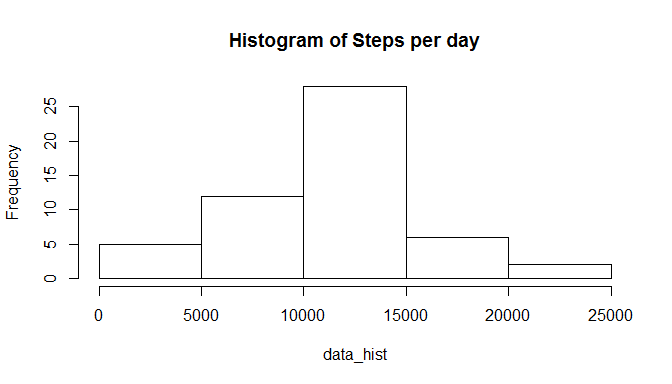
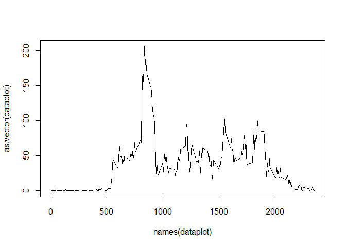
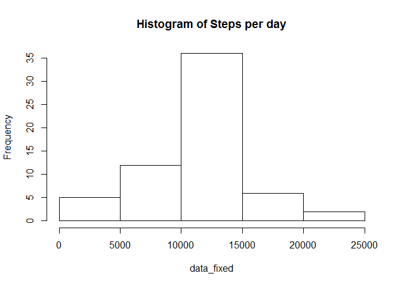
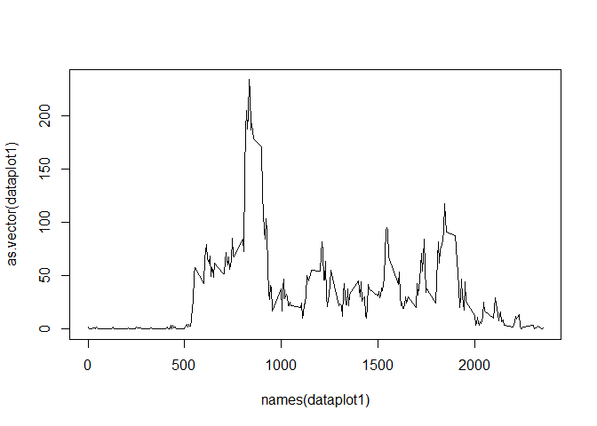
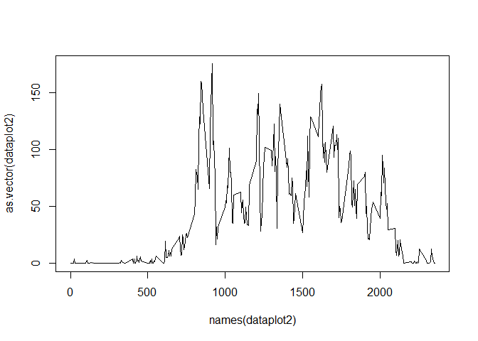

# Reproducible Research: Peer Assesment 1
Mike Ceballos  

This report shows how was Peer Assesment 1 executed. It contains an explanation of code required, as well as results obtained during running time.

##Loading and preprocessing the data
It is necessary to set work directory previous to load data.Then data will be loaded in "activity" variable:

```r
setwd("C:/Users/204024285/Documents/MisPrimerosProyectos/Reproducible Research")
activity<-read.csv("activity.csv")
```
Next step is to review data structure and get a summary of current information. 

```r
str(activity)
```

```
## 'data.frame':	17568 obs. of  3 variables:
##  $ steps   : int  NA NA NA NA NA NA NA NA NA NA ...
##  $ date    : Factor w/ 61 levels "2012-10-01","2012-10-02",..: 1 1 1 1 1 1 1 1 1 1 ...
##  $ interval: int  0 5 10 15 20 25 30 35 40 45 ...
```

```r
summary(activity)
```

```
##      steps                date          interval     
##  Min.   :  0.00   2012-10-01:  288   Min.   :   0.0  
##  1st Qu.:  0.00   2012-10-02:  288   1st Qu.: 588.8  
##  Median :  0.00   2012-10-03:  288   Median :1177.5  
##  Mean   : 37.38   2012-10-04:  288   Mean   :1177.5  
##  3rd Qu.: 12.00   2012-10-05:  288   3rd Qu.:1766.2  
##  Max.   :806.00   2012-10-06:  288   Max.   :2355.0  
##  NA's   :2304     (Other)   :15840
```
At this point, it is able to make the analysis without further changes in current dataset.

## What is mean total number of steps taken per day?
According with assignment, I calculated the total number of steps taken per day, using tapply function as follows:

```r
data_hist<-tapply(activity$steps, activity$date, sum)
data_hist
```

```
## 2012-10-01 2012-10-02 2012-10-03 2012-10-04 2012-10-05 2012-10-06 
##         NA        126      11352      12116      13294      15420 
## 2012-10-07 2012-10-08 2012-10-09 2012-10-10 2012-10-11 2012-10-12 
##      11015         NA      12811       9900      10304      17382 
## 2012-10-13 2012-10-14 2012-10-15 2012-10-16 2012-10-17 2012-10-18 
##      12426      15098      10139      15084      13452      10056 
## 2012-10-19 2012-10-20 2012-10-21 2012-10-22 2012-10-23 2012-10-24 
##      11829      10395       8821      13460       8918       8355 
## 2012-10-25 2012-10-26 2012-10-27 2012-10-28 2012-10-29 2012-10-30 
##       2492       6778      10119      11458       5018       9819 
## 2012-10-31 2012-11-01 2012-11-02 2012-11-03 2012-11-04 2012-11-05 
##      15414         NA      10600      10571         NA      10439 
## 2012-11-06 2012-11-07 2012-11-08 2012-11-09 2012-11-10 2012-11-11 
##       8334      12883       3219         NA         NA      12608 
## 2012-11-12 2012-11-13 2012-11-14 2012-11-15 2012-11-16 2012-11-17 
##      10765       7336         NA         41       5441      14339 
## 2012-11-18 2012-11-19 2012-11-20 2012-11-21 2012-11-22 2012-11-23 
##      15110       8841       4472      12787      20427      21194 
## 2012-11-24 2012-11-25 2012-11-26 2012-11-27 2012-11-28 2012-11-29 
##      14478      11834      11162      13646      10183       7047 
## 2012-11-30 
##         NA
```
Now, an histogram is created to review data distribution.
 

Finally, the mean total of steps taken per day, without taking in consideration NA values, is: 1.0766189\times 10^{4}.

## What is the average daily activity pattern?

In order to solve this question, it is necessary to remove NA values and then calculate information asked by time interval. Finally, a time series plot is presented.

```r
data_interval<-na.omit(activity)
dataplot <- tapply(data_interval$steps, data_interval$interval, mean)
plot(as.vector(dataplot), x=names(dataplot), type="l")
```

 

```r
index<-which.max(as.vector(dataplot))
time_interval<-names(dataplot[index])
steps<-as.vector(dataplot[index])
```

The 5-minute interval with major steps were at 835 with 206.1698113 in average.


## Imputing missing values


Now, I will review the amount of missing values on this dataset, evaluating the number of rows with NA values.
The total of NAs values is 2304.

A simple strategy will be used to cover all missing values, taking in count average of steps per day. Therefore, a new dataset will be created similar to original, but filling missing values with average steps. Finally, a histogram will be created to visualize data.

```r
data_fixed <- data_hist
data_fixed[is.na(data_fixed)]<-mean(data_hist,na.rm=TRUE)
hist(data_fixed, main= paste("Histogram of Steps per day"))
```

 


## Are there differences in activity patterns between weekdays and weekends?

A new factor was created to split dataset in week days and weekends. Then, two plots were created to show data regarding time interval exercise.


```r
library(timeDate)
```

```
## Warning: package 'timeDate' was built under R version 3.1.3
```

```r
isWeekday(as.Date(names(data_fixed)))
```

```
## 2012-10-01 2012-10-02 2012-10-03 2012-10-04 2012-10-05 2012-10-06 
##       TRUE       TRUE       TRUE       TRUE       TRUE      FALSE 
## 2012-10-07 2012-10-08 2012-10-09 2012-10-10 2012-10-11 2012-10-12 
##      FALSE       TRUE       TRUE       TRUE       TRUE       TRUE 
## 2012-10-13 2012-10-14 2012-10-15 2012-10-16 2012-10-17 2012-10-18 
##      FALSE      FALSE       TRUE       TRUE       TRUE       TRUE 
## 2012-10-19 2012-10-20 2012-10-21 2012-10-22 2012-10-23 2012-10-24 
##       TRUE      FALSE      FALSE       TRUE       TRUE       TRUE 
## 2012-10-25 2012-10-26 2012-10-27 2012-10-28 2012-10-29 2012-10-30 
##       TRUE       TRUE      FALSE      FALSE       TRUE       TRUE 
## 2012-10-31 2012-11-01 2012-11-02 2012-11-03 2012-11-04 2012-11-05 
##       TRUE       TRUE       TRUE      FALSE      FALSE       TRUE 
## 2012-11-06 2012-11-07 2012-11-08 2012-11-09 2012-11-10 2012-11-11 
##       TRUE       TRUE       TRUE       TRUE      FALSE      FALSE 
## 2012-11-12 2012-11-13 2012-11-14 2012-11-15 2012-11-16 2012-11-17 
##       TRUE       TRUE       TRUE       TRUE       TRUE      FALSE 
## 2012-11-18 2012-11-19 2012-11-20 2012-11-21 2012-11-22 2012-11-23 
##      FALSE       TRUE       TRUE       TRUE       TRUE       TRUE 
## 2012-11-24 2012-11-25 2012-11-26 2012-11-27 2012-11-28 2012-11-29 
##      FALSE      FALSE       TRUE       TRUE       TRUE       TRUE 
## 2012-11-30 
##       TRUE
```

```r
data_interval$weekDay<-isWeekday(as.Date(data_interval$date))
weekDayData<- subset(data_interval, data_interval$weekDay)
weekEndData<- subset(data_interval, !data_interval$weekDay)
dataplot1<-tapply(weekDayData$steps, weekDayData$interval, mean)
dataplot2<-tapply(weekEndData$steps, weekEndData$interval, mean)
plot(as.vector(dataplot1), x=names(dataplot1), type="l")
```

 

```r
plot(as.vector(dataplot2), x=names(dataplot2), type="l")
```

 


For any comments, please don't hesitate to contact me (Miguel Ceballos).
